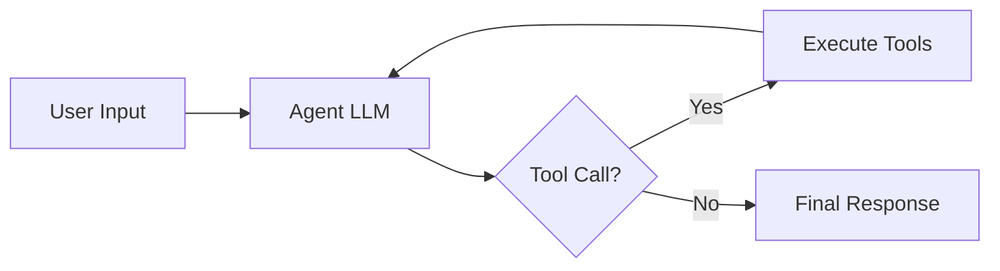
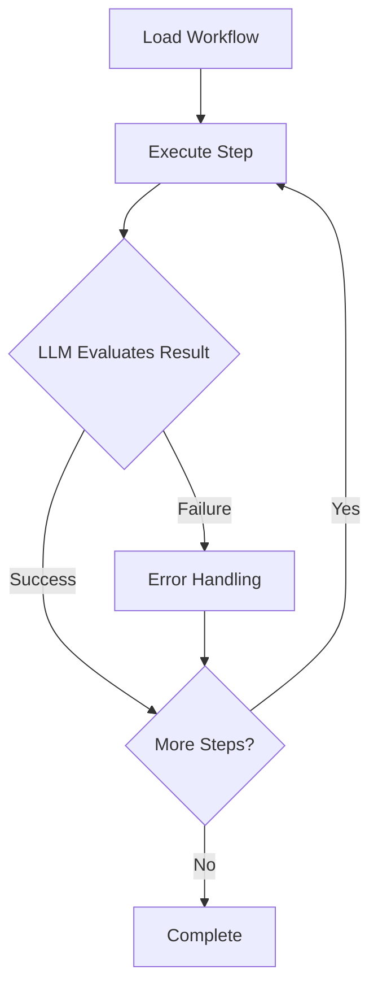

# PAN-OS LangGraph Agent

AI agent for automating Palo Alto Networks PAN-OS firewalls using natural language.
Built with LangGraph, using `httpx` for async HTTP and `lxml` for XML processing.

## Overview

This project demonstrates two approaches to AI-driven network automation:

| Mode | Description | Use Case |
|------|-------------|----------|
| **Autonomous** | ReAct agent with full tool access | Exploratory automation, ad-hoc tasks, |
|                 |                                 | natural language queries |
| **Deterministic** | Step-by-step workflows with conditional routing | Production workflows, |
|                    |                                                 | repeatable processes, |
|                    |                                                 | Ansible-like execution |

### Key Features

- 🤖 **Dual-mode operation**: Autonomous (ReAct) and Deterministic (workflow-based)
- 🔧 **Comprehensive PAN-OS support**: 33 tools across addresses, services, policies, NAT
- ⚡ **Fully async architecture**: Built on `httpx` and `lxml` for high-performance I/O
- 🎯 **LangGraph Studio integration**: Visual debugging and execution
- 📡 **Real-time streaming**: Live progress updates with emoji indicators (default)
- 🔄 **Retry logic**: Exponential backoff for transient failures
- 🏗️ **Composable subgraphs**: CRUD and commit workflows
- 📝 **Firewall commits**: Job polling with approval gates
- 💾 **Persistent checkpointing**: AsyncSqliteSaver for conversation history and failure recovery
- ✅ **XPath validation**: Structured XML generation with validation rules

## Quickstart

### 1. Prerequisites

- Python 3.11+ (managed via pyenv)
- uv package manager
- PAN-OS firewall (tested on 10.x+)
- Anthropic API key

### 2. Setup

```bash

# Install Python 3.11
pyenv install 3.11
pyenv local 3.11

# Create virtual environment with uv
uv venv
source .venv/bin/activate  # On Windows: .venv\Scripts\activate

# Install dependencies
uv pip install -e .

# Configure environment
cp .env.example .env
# Edit .env with your credentials

```

### 3. Environment Variables

```bash

# Required
PANOS_HOSTNAME=192.168.1.1
PANOS_USERNAME=admin
PANOS_PASSWORD=your_password
ANTHROPIC_API_KEY=sk-ant-your-key-here

# Optional
DEFAULT_MODE=autonomous
LOG_LEVEL=INFO

```

### 4. Run with LangGraph Studio

```bash

# Start LangGraph Studio
langgraph dev

# Or via CLI command (once implemented)
panos-agent studio

```

Then open `<http://localhost:8000`> and select a graph (autonomous or deterministic).

### 5. CLI Usage

```bash

# Autonomous mode (natural language)
panos-agent run -m autonomous -p "Create address object web-server at 10.1.1.100"
panos-agent run -m autonomous -p "List all service groups"

# Deterministic mode (predefined workflows)
panos-agent list-workflows  # Show all available workflows
panos-agent run -m deterministic -p "simple_address"
panos-agent run -m deterministic -p "web_server_setup"
panos-agent run -m deterministic -p "security_rule_complete"

# Disable streaming for CI/CD (get final output only)
panos-agent run -p "List address objects" --no-stream

# Test connection
panos-agent test-connection

# Version info
panos-agent version

```

## Model Selection

The agent supports runtime model and temperature selection, allowing you to choose the right balance of speed, cost, and capability for your use case.

### Choosing a Model

Use the `--model` flag to select which Claude model to use:

```bash
# Default: Fast Haiku model (balanced performance and cost)
panos-agent run -p "Create address object web-server at 10.1.1.100"

# Haiku: Fast and cheap (best for simple operations)
panos-agent run -p "List address objects" --model haiku

# Sonnet: More powerful (best for complex multi-step tasks)
panos-agent run -p "Create address and add to security policy" --model sonnet

# Full model name also supported
panos-agent run -p "List objects" --model claude-3-5-sonnet-20241022
```

### Model Comparison

| Model | Alias | Speed | Cost | Best For |
|-------|-------|-------|------|----------|
| **Claude Haiku 4.5** | `haiku` | ⚡⚡⚡⚡⚡ Fastest | 💵 Cheapest | **Default**, simple CRUD, list operations, batch processing |
| **Claude Sonnet 3.5** | `sonnet` | ⚡⚡⚡⚡ Fast | 💵💵💵 Moderate | Complex multi-step tasks, policy creation, analysis |
| **Claude Opus 3** | `opus` | ⚡⚡⚡ Moderate | 💵💵💵💵 Highest | Most powerful, deep analysis, recommendations |

**Currently Available Models:**

- `claude-haiku-4-5` (Haiku, latest - **default**)
- `claude-3-5-sonnet-20241022` (Sonnet 3.5)
- `claude-3-opus-20240229` (Opus 3)

### When to Use Each Model

**Use Haiku (default) for:**

- Simple list operations (`List all address objects`)
- Single CRUD operations (`Create address X`, `Delete service Y`)
- Batch operations with known patterns
- Development/testing (fast iteration)
- Cost-sensitive production workloads
- Most automation tasks (recommended default)

**Use Sonnet for:**

- Multi-step operations
- Policy creation with multiple objects
- Natural language queries requiring reasoning
- Complex workflows
- When quality matters more than speed

**Use Opus for:**

- Deep security analysis
- Policy recommendations and auditing
- Multi-constraint decision making
- Novel/ambiguous requests
- Advanced troubleshooting

### Temperature Control

The `--temperature` flag controls randomness in LLM responses (0.0 = deterministic, 1.0 = creative):

```bash
# Deterministic (default, recommended for most automation)
panos-agent run -p "Create address object server-1 at 10.1.1.1" --temperature 0.0

# More creative (useful for naming, descriptions, recommendations)
panos-agent run -p "Suggest descriptive names for these servers" --temperature 0.7

# Maximum creativity (rarely needed)
panos-agent run -p "Brainstorm security architectures" --temperature 1.0
```

**Recommendations:**

- **0.0 (default)**: Use for all CRUD operations, deterministic workflows
- **0.3-0.5**: Use for recommendations with some variety
- **0.7-1.0**: Use for creative tasks (naming, brainstorming)

### Cost Optimization Examples

```bash
# Development: Use Haiku for fast, cheap iteration (default)
panos-agent run -p "List objects"

# Production batch: Haiku for high-volume simple operations
panos-agent run -p "List all address objects"

# Complex tasks: Sonnet when you need better reasoning
panos-agent run -p "Setup web server security rules" --model sonnet

# Critical analysis: Opus when accuracy matters most
panos-agent run -p "Audit security policies for compliance" --model opus
```

### Streaming Mode (Default)

By default, the agent provides **real-time progress feedback** as it executes:

**Autonomous Mode:**

- 🤖 **Agent thinking...** - LLM is processing your request
- 🔧 **Executing tools...** - Running PAN-OS API operations
- ✅ **Complete** - Final response ready

**Deterministic Mode:**

- 📋 **Loading workflow...** - Parsing workflow definition
- 🔧 **Step 1/5: Creating address object...** - Step-by-step progress with descriptions
- 🔧 **Step 2/5: Updating security policy...**
- 📝 **Finalizing workflow...**
- ✅ **Workflow Complete**

**Example Output (Streaming):**

```bash
$ panos-agent run -p "Create address object test-123 at 10.1.1.123" -m autonomous

PAN-OS Agent - Mode: autonomous
Prompt: Create address object test-123 at 10.1.1.123

🤖 Agent thinking...
🔧 Executing tools...

✅ Complete

Response:
Successfully created address object 'test-123' with IP address 10.1.1.123
```

**Disable Streaming for Automation:**

Use `--no-stream` flag for scripts, CI/CD pipelines, or when you only need the final result:

```bash
# No progress indicators, just final output
panos-agent run -p "List address objects" --no-stream > output.txt
```

## Testing the Graphs

### Autonomous Mode Examples

Test the autonomous ReAct agent with natural language queries:

```bash

# List operations
panos-agent run -p "List all address objects" -m autonomous --log-level ERROR

# Create operations
panos-agent run -p "Create an address object named test-server-123 with IP 192.168.100.123" \\
  -m autonomous --log-level ERROR

# Delete operations
panos-agent run -p "Delete the address object named test-server-123" -m autonomous --log-level ERROR

# Complex queries
panos-agent run -p "Show me all NAT policies and explain what they do" \\
  -m autonomous --log-level ERROR

```

**Expected Output (List Example):**

```bash

PAN-OS Agent - Mode: autonomous
Prompt: List all address objects

Response:
Great! There are **37 address objects** currently configured on the PAN-OS
firewall.

Would you like me to:

- Get details about a specific address object?
- Filter or search for particular addresses?
- Create new address objects?
- Modify or delete existing ones?

Let me know how I can help!

Thread ID: 49d5513e-2763-4b54-bdfc-3b6f072d6020

```

### Deterministic Mode Examples

Test predefined workflows with step-by-step execution:

```bash

# List available workflows
panos-agent list-workflows

# Simple address creation workflow (2 steps)
panos-agent run -p "simple_address" -m deterministic

# Web server setup workflow (multi-object creation)
panos-agent run -p "web_server_setup" -m deterministic

# Workflow with approval gate
panos-agent run -p "address_with_approval" -m deterministic

```

**Expected Output (simple_address):**

```bash

PAN-OS Agent - Mode: deterministic
Prompt: simple_address

[14:08:32] INFO     Loading workflow: simple_address
           INFO     Executing step 1/2: Create address object
           INFO     Validating create for address
           INFO     Checking existence of address: demo-server
           INFO     Connected to PAN-OS 11.1.4-h7 (serial: 021201109830)
           INFO     Object exists: False
           INFO     Creating address: demo-server
           INFO     Successfully created address: demo-server
           INFO     Step evaluation: continue - Address object successfully created
           INFO     Executing step 2/2: Verify address object
           INFO     Validating read for address
           INFO     Reading address: demo-server

Response:
📊 Workflow 'simple_address' Execution Summary

Steps: 2/2
✅ Successful: 2
❌ Failed: 0

Step Details:

  1. ✅ Create address object

  2. ✅ Verify address object

Final Decision: continue
Reason: Address object successfully retrieved (demo-server). No errors reported.
Step completed as expected.

Thread ID: ac43a662-137c-464c-b118-c6d399a7fbe4

```

### Testing with Thread IDs

Both modes support conversation continuity using thread IDs:

```bash

# Start a conversation
panos-agent run -p "List address objects" -m autonomous --thread-id my-session-1

# Continue the same conversation
panos-agent run -p "Now create one called test-server at 10.1.1.1" -m autonomous --thread-id
  my-session-1

# Start a fresh conversation
panos-agent run -p "List address objects" -m autonomous --thread-id my-session-2

```

### Checkpoint Management

The agent uses persistent SQLite checkpointing to maintain conversation history and enable failure recovery. All checkpoints are stored in `data/checkpoints.db`.

#### List All Checkpoint Threads

```bash
panos-agent checkpoints list
```

**Example Output:**

```
Checkpoint Threads (3 threads)
┌────────────────────┬────────────────────────────────────────┬─────────────┐
│ Thread ID          │ Latest Checkpoint ID                   │ Checkpoints │
├────────────────────┼────────────────────────────────────────┼─────────────┤
│ prod-deploy-001    │ 1f0bd23e-fef4-6120-8002-e2c66c4e1ec0   │ 15          │
│ test-session-456   │ 1f0bd23c-6c05-67d0-8004-c985a2270312   │ 8           │
│ debug-run-789      │ 1f0bd23b-1e96-6428-8001-c286154994e9   │ 3           │
└────────────────────┴────────────────────────────────────────┴─────────────┘
```

#### Show Checkpoint Details

```bash
panos-agent checkpoints show <thread_id>
```

Displays checkpoint state, message count, and metadata for a specific thread.

#### View Checkpoint History

```bash
panos-agent checkpoints history <thread_id>
```

Shows all checkpoints for a thread with timestamps and step numbers.

#### Delete Checkpoints

```bash
# Delete specific thread (with confirmation)
panos-agent checkpoints delete <thread_id>

# Force delete without confirmation
panos-agent checkpoints delete <thread_id> --force
```

#### Prune Old Checkpoints

```bash
# Delete checkpoints older than 30 days (default)
panos-agent checkpoints prune

# Delete checkpoints older than 7 days
panos-agent checkpoints prune --days 7

# Force prune without confirmation
panos-agent checkpoints prune --days 30 --force
```

**Benefits:**

- **Persistence**: Conversations survive application restarts
- **Recovery**: Resume from any checkpoint after failures
- **Time-Travel**: View and fork from historical states
- **Auditing**: Complete history of all operations

---

### Memory & Context

The agent uses LangGraph's Store API to maintain **long-term memory** across sessions. Unlike checkpoints (which store conversation state), memory stores operational context and history.

#### What Data is Remembered

**Firewall Configuration State:**

- Object counts per config type (address objects, services, policies, etc.)
- Recent operations (last 10 create/update/delete operations)
- Last updated timestamps

**Workflow Execution History:**

- Execution metadata (started_at, completed_at, status)
- Steps executed and results
- Success/failure status for auditing

#### How Memory Works

**Autonomous Mode:**

- Before each agent call, retrieves firewall operation summary
- Adds context to system prompt: "Previously created 5 address objects, updated 2 policies"
- After tool execution, stores operation results in memory
- Enables context-aware responses across sessions

**Deterministic Mode:**

- Stores workflow execution history after completion
- Tracks success/failure status and step results
- Enables workflow execution auditing and analysis

#### Memory Persistence

**Current Implementation:** `InMemoryStore`

- Data stored in RAM
- Lost on process restart
- Suitable for development and single-session use

**Future Upgrade:** Persistent Store (PostgreSQL, Redis, etc.)

- Data survives restarts
- Suitable for production multi-user deployments
- Requires external database

#### Example: Memory in Action

```bash
# First session - create address objects
panos-agent run -p "Create address objects web-1, web-2, web-3" -m autonomous

# Second session (same firewall) - agent remembers previous operations
panos-agent run -p "List all address objects" -m autonomous
# Agent response includes: "I see you previously created 3 address objects (web-1, web-2, web-3)"
```

#### Memory Schema

For detailed information about memory namespaces, keys, and data structures, see:

- `docs/MEMORY_SCHEMA.md` - Complete memory schema documentation

**Key Features:**

- **Namespace Isolation**: Each firewall has separate namespace
- **Config Type Tracking**: Separate tracking per object type
- **Operation History**: Last 10 operations per config type
- **Workflow Auditing**: Complete execution history per workflow

---

**Benefits:**

- **Persistence**: Conversations survive application restarts
- **Resume**: Continue from failures using same thread_id
- **Time-travel**: Inspect historical checkpoint states
- **Cleanup**: Manage disk space with prune commands

### Connection Testing

Always test your connection first before running operations:

```bash

panos-agent test-connection

```

**Expected Output:**

```bash

Testing PAN-OS connection...

✅ Connected to PAN-OS 11.1.4-h7 (serial: 021201109830)

```

## Observability

### LangSmith Integration

This project includes built-in observability through LangSmith for debugging, monitoring, and improving your AI workflows.

**What you get:**

- **Execution traces**: See every LLM call, tool execution, and state transition
- **Performance metrics**: Track latency, token usage, and costs
- **Debugging**: Inspect inputs/outputs at each step of the graph
- **Filtering**: Use tags and metadata to find specific traces

### Setup

1. **Get a LangSmith API key** at [smith.langchain.com](https://smith.langchain.com)

2. **Add to your `.env` file:**

```bash
# LangSmith Observability (optional)
LANGSMITH_TRACING=true
LANGSMITH_API_KEY=lsv2_pt_your_api_key_here
LANGSMITH_PROJECT=panos-agent-prod
```

3. **Run your agent** - traces automatically appear in LangSmith

### Metadata and Tags

Every execution includes rich metadata for filtering:

**Tags:**

- `panos-agent` - All executions from this agent
- `autonomous` or `deterministic` - Execution mode
- Workflow name (deterministic mode only)
- `v0.1.0` - Version tag

**Metadata:**

- `mode` - autonomous or deterministic
- `thread_id` - Conversation thread ID
- `firewall_host` - Target PAN-OS firewall
- `timestamp` - ISO format execution time
- `user_prompt_length` - Size of user input
- `workflow` - Workflow name (deterministic mode)

**Example filtering in LangSmith:**

- Filter by tag: `panos-agent` AND `autonomous`
- Filter by metadata: `firewall_host = "192.168.1.1"`
- Time range + workflow: Last 7 days where `workflow = "web_server_setup"`

### Security

**Automatic data masking**: All traces use client-side anonymizers to prevent credential leakage:

- PAN-OS API keys → `<panos-api-key>`
- Anthropic API keys → `<anthropic-api-key>`
- Password fields → `password: <password>`
- XML password elements → `<password><redacted></password>`

Anonymization happens **before** traces are sent to LangSmith, so sensitive data never leaves your environment.

### Testing Anonymization

Before enabling production tracing, verify that sensitive data is properly masked:

```bash
# Set your LangSmith API key
export LANGSMITH_API_KEY="lsv2_pt_your_key_here"

# Run anonymization tests
./scripts/test_anonymization.sh
```

The test will:

1. Send test data containing fake API keys and passwords
2. Print unique test run IDs for each test
3. Provide instructions for manual verification in LangSmith UI

**Manual verification steps:**

1. Go to [smith.langchain.com](https://smith.langchain.com)
2. Search for the test run IDs printed by the script
3. Verify that sensitive values are replaced with placeholders like `<panos-api-key>` and `<password>`

**What success looks like:**

- ✅ API keys appear as `<panos-api-key>`
- ✅ Passwords appear as `password: <password>`
- ✅ No actual sensitive values visible in traces

**What failure looks like:**

- ❌ Actual API keys or passwords visible in traces
- Review `src/core/anonymizers.py` patterns if anonymization fails

See `tests/integration/test_langsmith_anonymization.py` for detailed test documentation.

## Timeouts

### Execution Timeouts

All graph invocations include automatic timeout protection to prevent runaway executions and ensure responsive behavior.

**Default Timeouts:**

- **Autonomous mode**: 300 seconds (5 minutes)
  - Allows for ~10-15 ReAct iterations with typical LLM response times
  - Covers multiple tool executions and LLM reasoning loops

- **Deterministic mode**: 600 seconds (10 minutes)
  - Allows for complex multi-step workflows
  - Includes time for commit operations and approval gates

- **Commit operations**: 180 seconds (3 minutes)
  - PAN-OS commits typically take 30-120 seconds
  - Provides buffer for slow commits while preventing indefinite hangs

### Timeout Behavior

When a timeout occurs:

1. **Execution stops immediately** - Graph execution is terminated
2. **Error message** - User-friendly timeout error with context
3. **Logging** - Timeout logged with mode, thread_id, and prompt details
4. **Exit code 1** - CLI exits with error code for scripting

**Example timeout error:**

```bash
Timeout Error: Graph execution exceeded 300.0s timeout
Mode: autonomous
Thread ID: abc-123-def
Prompt preview: Create 100 address objects and security rules...
```

### Overriding Timeouts

Timeouts are configured in `src/core/config.py` as module constants. To adjust timeouts, modify:

```python
TIMEOUT_AUTONOMOUS = 300.0      # Change to desired seconds
TIMEOUT_DETERMINISTIC = 600.0   # Change to desired seconds
TIMEOUT_COMMIT = 180.0          # Change to desired seconds
```

**When to increase timeouts:**

- Large-scale batch operations (100+ objects)
- Complex workflows with many steps (10+ steps)
- Slow firewall commits (older hardware, large configs)

**When to decrease timeouts:**

- Fast development/testing cycles
- Simple queries that should complete quickly
- CI/CD pipelines with strict time limits

## Error Handling & Resilience

### Automatic Retry Policies

All PAN-OS API operations include automatic retry handling with exponential backoff to gracefully handle transient failures like network issues and temporary connection problems.

**Retry behavior:**

- **Max attempts:** 3 (initial attempt + 2 retries)
- **Backoff strategy:** Exponential with factor 2.0
  - 1st retry: 2 seconds delay
  - 2nd retry: 4 seconds delay
  - 3rd retry: 8 seconds delay

**Retryable errors (automatically retried):**

- `PanConnectionTimeout` - Firewall connection timeouts
- `PanURLError` - Network/URL errors (DNS, routing issues)
- `ConnectionError` - Generic network connection failures
- `TimeoutError` - Operation timeouts

**Non-retryable errors (fail immediately):**

- `PanDeviceError` - Configuration/validation errors
- `PanObjectError` - Object-specific errors (already exists, not found)
- All other exceptions - Unknown errors fail fast

### Commit Operations

Commit operations use a specialized retry policy optimized for user-facing feedback:

- **Max attempts:** 2 (initial + 1 retry)
- **Backoff:** Exponential with factor 1.5 (delays: 1.5s, 2.25s)
- **Retryable errors:** Connection and network errors only

Commits fail quickly to provide rapid feedback, as retrying configuration errors is unlikely to succeed.

### Retry Logging

LangGraph automatically logs all retry attempts. You'll see messages like:

```
[WARNING] Attempt 1/3 failed: PanConnectionTimeout: Connection timed out. Retrying in 2.0s...
[WARNING] Attempt 2/3 failed: PanConnectionTimeout: Connection timed out. Retrying in 4.0s...
[INFO] Operation succeeded after 2 retries
```

Or on final failure:

```
[ERROR] Max retries (3) exceeded: PanConnectionTimeout: Connection timed out
```

### Error Classification

The agent classifies errors into three tiers:

1. **Tier 1 - Connectivity Errors (Retryable)**
   - Network timeouts, DNS failures, connection resets
   - Automatically retried with exponential backoff
   - Example: `PanOSConnectionError`, `httpx.TimeoutException`, `httpx.NetworkError`

2. **Tier 2 - API/Configuration Errors (Non-retryable)**
   - Validation errors, object conflicts, permission issues
   - Fail immediately with clear error messages
   - Example: `PanOSAPIError: "Object already exists"`, `PanOSValidationError`

3. **Tier 3 - Unexpected Errors (Non-retryable)**
   - Unknown exceptions with full traceback logging
   - Reported for debugging and investigation

### Best Practices

**When retries help:**

- Temporary network issues
- Firewall under heavy load
- Transient API unavailability
- Brief connection interruptions

**When retries don't help (and the agent won't retry):**

- Invalid configuration (wrong IP format, invalid port)
- Duplicate object names
- Missing dependencies (referenced objects don't exist)
- Permission/authentication errors

**Manual intervention needed for:**

- Persistent network issues (check firewall connectivity)
- Configuration errors (fix input parameters)
- Permission issues (verify API credentials)

### Recovering from Failures

The agent uses checkpointing to save conversation state after every step, allowing you to resume from failures without losing progress.

**Checkpoint features:**

- **Automatic state persistence** - Every graph step is saved
- **Thread-based isolation** - Each conversation has its own checkpoint history
- **Resume capability** - Continue from the last successful step after errors
- **Time-travel debugging** - View and fork from any historical checkpoint

#### Resuming After Failures

If an operation fails (timeout, network error, tool failure), you can resume using the same thread ID:

```bash
# Initial execution fails after 3 steps
panos-agent run -p "Create 10 address objects" -m autonomous --thread-id session-123
# Error: Operation timed out after creating 3 objects

# Resume from last checkpoint - continues from step 4
panos-agent run -p "Continue creating the remaining objects" -m autonomous --thread-id session-123
# Picks up where it left off, creates objects 4-10
```

**Key points:**

- Use the **same thread ID** to resume the conversation
- The agent has access to **full conversation history**
- Previous tool results are **remembered** (no duplicate work)
- Works for both **autonomous and deterministic** modes

#### Common Recovery Scenarios

**1. Timeout during long workflow:**

```bash
# Workflow times out at step 5/10
panos-agent run -p "complex_workflow" -m deterministic --thread-id wf-001
# Timeout Error: Graph execution exceeded 600.0s timeout

# Resume with same thread_id - continues from step 6
panos-agent run -p "complex_workflow" -m deterministic --thread-id wf-001
```

**2. Network error during batch operation:**

```bash
# Network fails after creating 5/20 objects
panos-agent run -p "Create 20 address objects" --thread-id batch-001
# ❌ Error: PanConnectionTimeout

# Fix network, resume with same thread - creates remaining 15
panos-agent run -p "Continue the batch creation" --thread-id batch-001
```

**3. Tool failure requiring correction:**

```bash
# Tool fails due to invalid input
panos-agent run -p "Create address with IP 256.1.1.1" --thread-id fix-001
# ❌ Error: Invalid IP address

# Correct the input and retry with same thread
panos-agent run -p "Create address with IP 192.168.1.1 instead" --thread-id fix-001
# Agent remembers the error and uses corrected input
```

#### Starting Fresh

To start a new conversation without history, use a **different thread ID** or omit it entirely:

```bash
# Fresh conversation (auto-generates thread ID)
panos-agent run -p "List address objects" -m autonomous

# Fresh conversation with explicit new thread ID
panos-agent run -p "List address objects" --thread-id session-new-001
```

#### Advanced: Checkpoint History

Each thread maintains a full checkpoint history. While CLI commands for viewing history are planned (see [docs/TROUBLESHOOTING.md](docs/TROUBLESHOOTING.md)), you can currently:

- **View checkpoints** - Use LangGraph Studio to visualize checkpoint history
- **Fork from checkpoint** - Create a new thread from any historical point (time-travel)
- **Inspect state** - See exact state at any step in the workflow

For detailed troubleshooting scenarios and recovery strategies, see **[docs/TROUBLESHOOTING.md](docs/TROUBLESHOOTING.md)**.

## Testing Commands

### Quick Functionality Tests

Test all major features with these commands:

```bash
# Test basic autonomous mode (list operation)
panos-agent run -p "List all address objects"

# Test with different models
panos-agent run -p "List address objects" --model haiku
panos-agent run -p "List services" --model sonnet

# Test temperature control
panos-agent run -p "Suggest creative names for web servers" --temperature 0.7

# Test deterministic workflow mode
panos-agent run -m deterministic -p "web_server_setup"

# Test with specific thread (conversation resume)
panos-agent run -p "List address objects" --thread-id test-session-1
panos-agent run -p "Now create one called web-1" --thread-id test-session-1

# Test checkpoint management
panos-agent checkpoints list
panos-agent checkpoints show --thread-id test-session-1
```

### Model Selection Testing

```bash
# Default model (Haiku - fast and cheap)
panos-agent run -p "List address objects"

# Sonnet (better for complex tasks)
panos-agent run -p "Create address web-1 at 10.1.1.100 and add to zone trust" --model sonnet

# Full model name
panos-agent run -p "List objects" --model claude-3-5-sonnet-20241022

# No-stream mode (for CI/CD)
panos-agent run -p "List objects" --no-stream
```

### Temperature Testing

```bash
# Deterministic (default - best for automation)
panos-agent run -p "List address objects" --temperature 0.0

# Moderate creativity (recommendations)
panos-agent run -p "Suggest improvements to my security policies" --temperature 0.5

# High creativity (brainstorming)
panos-agent run -p "Generate descriptive names for 5 database servers" --temperature 0.8
```

### Memory & Context Testing

```bash
# First operation - agent stores in memory
panos-agent run -p "Create address object web-server-1 at 10.1.1.100"

# Second operation - agent recalls previous context
panos-agent run -p "List all address objects I created"
# Agent will reference the web-server-1 from memory context

# Workflow execution history
panos-agent run -m deterministic -p "web_server_setup"
# Agent stores execution metadata for later analysis
```

### Integration Tests

```bash
# Test full workflow: create, list, verify
panos-agent run -p "Create address object test-server at 192.168.1.10"
panos-agent run -p "List all address objects with 'test' in the name"
panos-agent run -p "Show details for test-server"

# Test with thread persistence
THREAD_ID=$(uuidgen)
panos-agent run -p "Create address web-1 at 10.1.1.1" --thread-id $THREAD_ID
panos-agent run -p "Create address web-2 at 10.1.1.2" --thread-id $THREAD_ID
panos-agent run -p "List all addresses I just created" --thread-id $THREAD_ID
```

### Performance Testing

```bash
# Benchmark Haiku (fastest)
time panos-agent run -p "List address objects" --model haiku --no-stream

# Benchmark Sonnet (more capable)
time panos-agent run -p "List address objects" --model sonnet --no-stream

# Test streaming vs non-streaming
panos-agent run -p "List address objects"           # Streaming (real-time feedback)
panos-agent run -p "List address objects" --no-stream  # No streaming (wait for completion)
```

### Unit Tests

Run the test suite:

```bash
# Run all tests
uv run pytest -v

# Run specific test categories
uv run pytest tests/unit/test_runtime_context.py -v
uv run pytest tests/unit/test_cli_model_selection.py -v
uv run pytest tests/unit/test_memory_store.py -v
uv run pytest tests/unit/test_autonomous_nodes.py -v

# Run with coverage
uv run pytest --cov=src --cov-report=html

# Run only passing tests (skip known failing integration tests)
uv run pytest tests/unit/ -v
```

---

## Evaluation & Testing

### LangSmith Evaluation

The agent includes a comprehensive evaluation framework to measure performance, accuracy, and reliability across different operation types.

**Evaluation Metrics:**

- **Success Rate** - % of examples completed successfully (target: ≥90%)
- **Tool Accuracy** - % using correct tools (target: ≥95%)
- **Response Completeness** - % with complete answers
- **Error Handling** - % of errors handled gracefully (target: 100%)
- **Token Efficiency** - Average tokens per operation (<10k target)

#### Running Evaluation

```bash
# Evaluate both autonomous and deterministic modes
python scripts/evaluate.py --mode both --save-results

# Evaluate specific mode
python scripts/evaluate.py --mode autonomous
python scripts/evaluate.py --mode deterministic

# View results
cat evaluation_results/eval_autonomous_*.json
```

#### Evaluation Dataset

The agent uses a curated evaluation dataset with 8+ examples covering:

- **Simple List Operations** (4 examples) - Read-only queries
- **CRUD Create** (1 example) - Object creation
- **CRUD Delete** (1 example) - Object deletion
- **Multi-step Operations** (1 example) - Complex queries
- **Error Handling** (1 example) - Invalid inputs
- **Workflows** (1 example) - Deterministic execution

**Using Example Dataset (Local):**

```bash
# Use built-in example dataset
python scripts/evaluate.py --mode both
```

**Creating LangSmith Dataset:**

```bash
# Create dataset in LangSmith (requires LANGSMITH_API_KEY)
python scripts/evaluate.py --create-dataset --dataset panos-agent-eval-v1

# Use LangSmith dataset for evaluation
python scripts/evaluate.py --dataset panos-agent-eval-v1 --mode both
```

**Loading from LangSmith:**

```bash
# Load existing dataset from LangSmith
python scripts/evaluate.py --dataset panos-agent-eval-v1 --mode autonomous
```

See **[docs/EVALUATION_DATASET.md](docs/EVALUATION_DATASET.md)** for complete dataset definition and LangSmith setup instructions.

**For detailed usage examples, testing integration, and dataset creation guides, see:**

- **[docs/EVALUATION_GUIDE.md](docs/EVALUATION_GUIDE.md)** - Complete evaluation guide with examples

**Quick Start with Makefile:**

```bash
# Setup (creates venv and installs dependencies)
make install

# Run evaluation locally
make evaluate

# Run evaluation in CI (fails if <90% success)
make evaluate-ci

# Manage datasets
make dataset-create DATASET=panos-agent-eval-v1  # Shows template guide after creation
make dataset-list
```

**Note:** When creating a dataset, a commented template is displayed to help you create custom datasets.

See `make help` for all available targets.

#### Continuous Evaluation

**Weekly Regression Testing:**

```bash
# Run weekly to detect regressions
python scripts/evaluate.py --mode both --save-results

# Alert if success rate drops >5%
```

**Pre-Deployment Validation:**

```bash
# Before deploying new version
python scripts/evaluate.py --mode both

# Ensure success rate ≥90%
# Ensure no critical regressions
```

### Test Coverage

**Unit Tests:** 63/67 passing (94%)

- Autonomous graph nodes
- Deterministic graph nodes
- CRUD subgraph nodes
- CLI timeout handling
- Anonymizers

**Integration Tests:** 6/20 passing (30%)

- Autonomous graph end-to-end
- Deterministic graph workflows
- Subgraph execution
- Checkpoint/resume functionality

```bash
# Run all tests
pytest

# Run unit tests only
pytest tests/unit/

# Run integration tests only
pytest tests/integration/

# Run with coverage report
pytest --cov=src --cov-report=html
```

## Architecture

### Project Structure

```bash

panos-agent/
├── src/
│   ├── autonomous_graph.py      # ReAct agent graph
│   ├── deterministic_graph.py   # Workflow graph
│   ├── main.py                  # Graph orchestrator
│   ├── core/
│   │   ├── client.py            # PAN-OS firewall client
│   │   ├── config.py            # Environment config
│   │   ├── state_schemas.py     # All state definitions
│   │   ├── retry_helper.py      # Retry logic
│   │   └── subgraphs/
│   │       ├── crud.py          # Single object operations
│   │       ├── batch.py         # Parallel batch operations
│   │       ├── commit.py        # Commit workflow
│   │       └── deterministic.py # Workflow executor
│   ├── tools/
│   │   ├── address_objects.py
│   │   ├── services.py
│   │   ├── security_policies.py
│   │   ├── nat_policies.py
│   │   └── orchestration/
│   │       ├── crud_operations.py
│   │       └── batch_operations.py
│   └── cli/
│       └── commands.py
├── tests/
├── docs/
│   └── ARCHITECTURE.md
├── langgraph.json               # LangGraph Studio config
├── pyproject.toml
└── README.md

```

### Autonomous Mode

ReAct pattern: **agent → tools → agent** loop.



**Use cases:**

- "Show me all address objects"
- "Create security rule allowing web traffic from Trust to Untrust"
- "Find unused address groups and delete them"

### Deterministic Mode

Step-by-step workflow with conditional routing.



**Use cases:**

- Pre-defined security rule creation workflow
- Multi-step object provisioning
- Repeatable, auditable operations

**Key features:**

- **LLM-based conditional routing**: Agent evaluates each step result
- **HITL approval gates**: Human approval required at critical points
- **Sequential execution**: Predictable, step-by-step workflow
- **Error handling**: Stops on critical errors with detailed reporting

**Available workflows** (6 total):

- `simple_address`: Create and verify single address object
- `address_with_approval`: Address creation with approval gate
- `web_server_setup`: Multi-object creation (addresses, services, groups)
- `multi_address_creation`: Multiple addresses with grouping
- `network_segmentation`: Complete network segment setup
- `complete_security_workflow`: Full workflow with object creation + policy + commit

## Development Status

### ✅ Phase 1: Foundation (Completed)

- [x] Python/uv setup
- [x] Project structure
- [x] Core modules (config, client, state_schemas, retry_helper)
- [x] LangGraph Studio configuration

### ✅ Phase 2: Tools & Subgraphs (Completed)

- [x] PAN-OS tools (22 tools: addresses, services, groups)
- [x] CRUD subgraph
- [x] Orchestration tools (crud_operation)

### ✅ Phase 3: Dual-Mode Graphs (Completed)

- [x] Autonomous graph implementation (ReAct agent)
- [x] Deterministic graph implementation (workflow executor)
- [x] CLI commands (run, list-workflows, test-connection, studio)
- [x] 6 basic workflows with approval gates

### ✅ Phase 4: Advanced Features (Completed)

- [x] **Commit subgraph**: PAN-OS commit with job polling and approval gates
- [x] **Expanded policy tools**: Security policy full CRUD (5 tools)
- [x] **NAT policy tools**: Basic NAT CRUD (4 tools)
- [x] **Orchestration tools**: crud_operation, commit_changes
- [x] **Total: 33 tools** across all categories

### ✅ Phase 5: Testing & Polish (Completed)

- [x] **Pre-commit hooks**: black, flake8, isort auto-formatting
- [x] **Pytest configuration**: Test framework setup with fixtures
- [x] **Mock fixtures**: Firewall, objects, sample data
- [x] **ARCHITECTURE.md**: Comprehensive technical guide
- [x] **SETUP.md**: Development environment guide
- [x] **Code quality**: Linting and formatting standards

## Documentation

### 📚 For Developers

- **[ARCHITECTURE.md](docs/ARCHITECTURE.md)**: Complete technical architecture guide
  - **ReAct vs Deterministic comparison**: Detailed workflows, structures, decision-making
  - State management patterns
  - Subgraph design (CRUD, Commit, Deterministic)
  - Testing strategy
  - Troubleshooting guide

- **[SETUP.md](docs/SETUP.md)**: Development environment setup
  - Installation steps
  - IDE configuration
  - Development workflow
  - Pre-commit hooks
  - Common issues

### 🎓 For Users

- **README.md** (this file): Overview and quickstart
- **Workflows**: See `panos-agent list-workflows`
- **LangGraph Studio**: Run `langgraph dev` for visual interface

## Contributing

This is a standalone example project within the broader `paloaltonetworks-automation-examples`
  repository.

## License

See repository root for license information.

## Resources

- [LangGraph Documentation](https://langchain-ai.github.io/langgraph/)
- [httpx Documentation](https://www.python-httpx.org/) - Async HTTP client
- [lxml Documentation](https://lxml.de/) - XML processing
- [PAN-OS XML API Reference](https://docs.paloaltonetworks.com/pan-os/11-0/pan-os-panorama-api)

---

**Status**: ✅ Complete (All 5 phases + Phase 1 observability)
**Features**: 33 tools, commit workflow, 6 workflows, LangSmith observability, comprehensive docs
**Coverage**: Architecture guide, setup guide, testing examples
**Recent Updates**:

- ✅ LangSmith environment variables and anonymizers (Phase 1.1-1.2)
- ✅ Metadata and tags for observability (Phase 1.3)
- ✅ Migrated from pan-os-python to httpx + lxml (fully async)
- ✅ Added XPath validation and structure mapping
- ✅ AsyncSqliteSaver for async checkpointing

**Last Updated**: 2025-01-09
